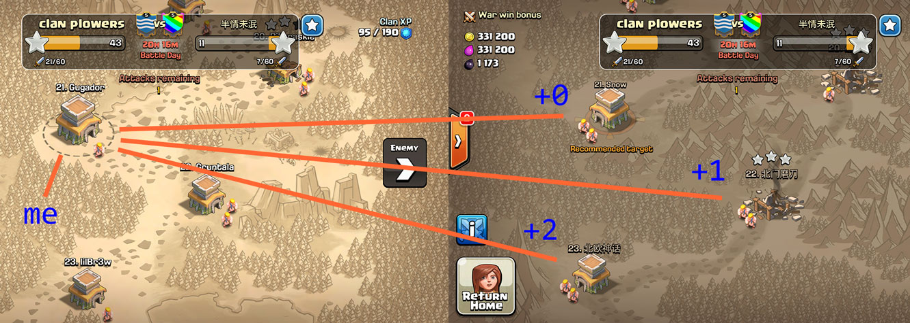
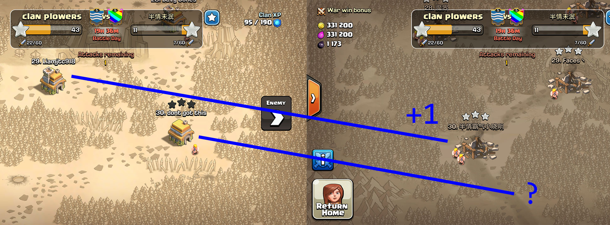
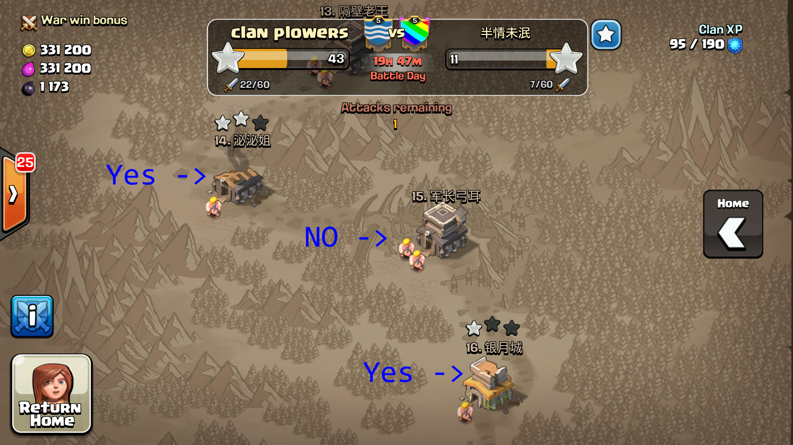

# Clan Plowers War Rules

## First Attack (Stick to the Strategy)

Before each war, a clan mail will be sent saying what the "plus" is for this war. This will be a number like +0, +1, +2, +3.
This number indicates who you should attack for your first attack. You take your base number and add the strategy offset to it to determine who to attack first.

For example, if my number in the war is 21, and the strategy is +1, then my first attack should be on the enemy number 22 (21 + 1 = 22)

### Ambiguity of the Bottom.

If the war strategy is +1, then the very bottom person doesn't have a target.

The players who have an unassigned target can choose to instead go for their even number, whether it has been attacked or not. (if the strategy was +2, then this would be applicable to the bottom 2 players)

Alternatively, you can just wait to see if another base needs cleanup later, or wait to loot toward the end of the war, or hit another target after the 12hr mark. Ideally, in a 30 player war as shown here, 30 would attack 30 first, and if they do not 3-star, then 29 would clean up 30. If 30 3-stars 30, then 29 could choose to also attack 30 for practice or loot, or just wait to see if cleanup is needed later on 28 or 29. In this example, if 30 3-stars 30, then 29 should not attack 29 during the first 12 hours because that target is assigned to someone else. Once 28 has a chance to attack 29, then it becomes open to attack.

## Second Attack

### During the first 12 hours

To be fair and give everyone a change to earn stars toward their acheivement, during the first 12 hours of the war each player should get the first chance attheir assigned target. From the example above, my assigned first attack number is 22 (21+1) so noone else should attack number 22 in the first 12 hours **unless** I have already had my chance to attack it, and did not 3-star.

In other words, you can use your second attack in the first 12 hours if there is a base that has already been attacked but not 3-starred, and you think you can 3-star it.

So for example if you were number 15, and the war map looked like this, then you could attack 14 or 16 because it has already been attacked, but not 3-starred (assuming you think you can actually 3-star either of them). But do not attack 15 because the person originally assigned to attack it has not already taken their turn.

### After 12 hours

All bases become fair game after 12 hours have elapsed. Even unattacked bases can be attacked at this point by players who were not assigned to it. Just go pick up stars wherever you can!

### Looting

Your first priority should be to pick up stars to ensure a win. If we are nearly to the end of the war and are clearly going to win, you can try to go as high as you can for your second attack to get loot.

If you have your second attack remaining but all bases you think you can 3-star have already been 3-starred, then go for loot.

# Bootable Offenses

* Stealing someone else's target in the first 12 hrs.
* Not using both attacks (unless you have already stated in clan chat that you can't be around to attack). This rule is especially true if we loose and you had an attack left that could have got us more stars!
* Being dumb with your attack. If you attack with 200 goblins, you get booted (unless you 3-star?).
* Not waiting to loot until we are sure to win.
